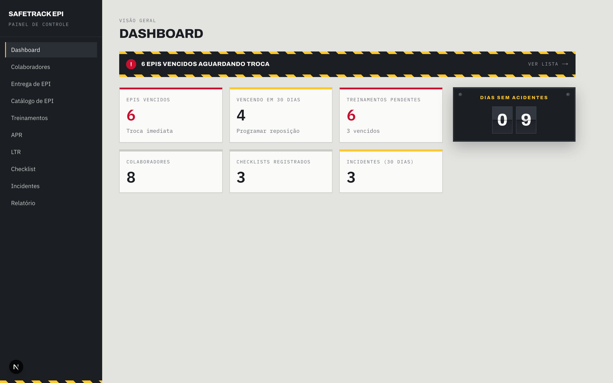
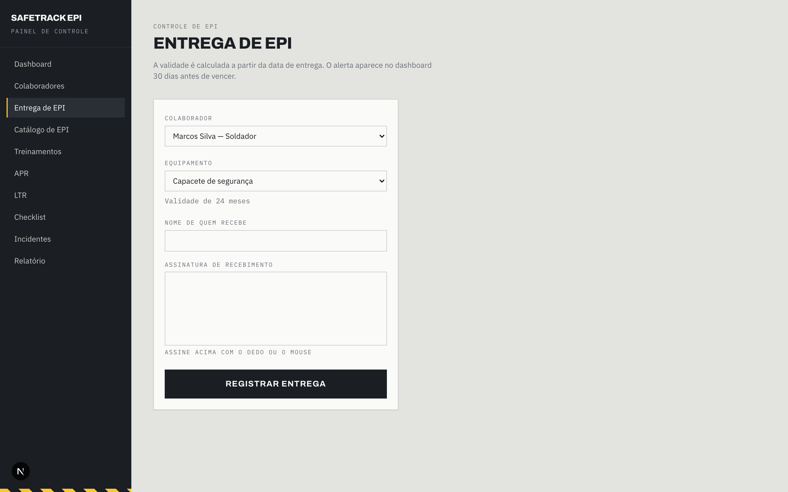
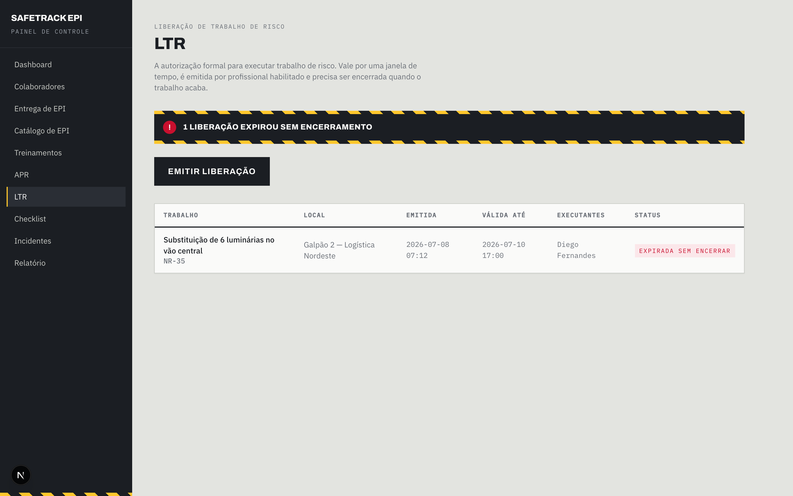
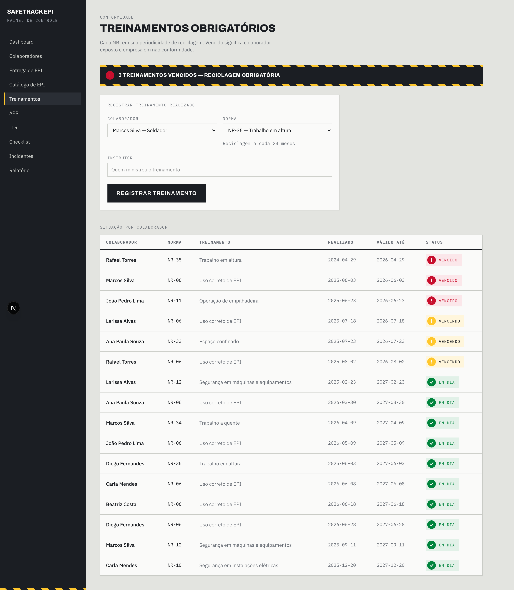
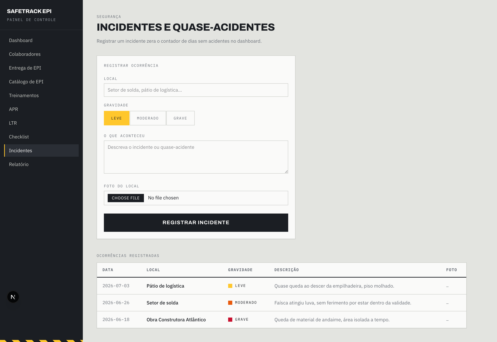

# SafeTrack EPI

Gestão de segurança do trabalho para empresas que fornecem EPI à indústria: entrega e
validade de equipamento, treinamentos NR e suas reciclagens, checklist de campo,
incidentes, e emissão de APR e LTR.

O diferencial está no cruzamento: antes de liberar um trabalho de risco, o sistema
confere se o colaborador tem **treinamento NR válido** e o **EPI necessário entregue e
dentro da validade**. Sem os dois, a LTR não sai.

> ⚠️ **Protótipo de demonstração comercial.** Sem back-end persistente real, sem
> autenticação, dados fictícios. Não é produção.



## Glossário

Os termos abaixo aparecem em toda a interface e no código:

| Sigla | Significa |
| --- | --- |
| **EPI** | Equipamento de Proteção Individual |
| **NR** | Norma Regulamentadora (treinamento obrigatório por tipo de risco) |
| **APR** | Análise Preliminar de Risco |
| **LTR** | Liberação de Trabalho de Risco (a permissão de trabalho propriamente dita) |

## Telas

| Entrega de EPI — QR code e assinatura por entrega | LTR — emissão condicionada a treinamento + EPI válidos |
| --- | --- |
|  |  |
| **Treinamentos** — validade e reciclagem de NR | **Incidentes** |
|  |  |

Demais telas em [`docs/screenshots/`](docs/screenshots/): landing, colaboradores,
catálogo de EPI, APR, checklist e relatório.

## Stack

- **Next.js 16** (App Router) · **React 19** · **TypeScript**
- **Tailwind CSS v4**
- `qrcode` — QR na entrega de EPI (leva à página pública do equipamento)
- **Vitest** — testes só da lógica de domínio (`lib/*.test.ts`), por decisão: componentes e
  rotas não são testados neste protótipo
- Deploy: **Vercel**

### Banco: não existe

O "banco" é um arquivo JSON em `data/db.json`, lido e escrito por `lib/db.ts`. Em
serverless o filesystem é read-only, então `lib/db.ts` detecta `EROFS`/`EACCES`/`EPERM`
e cai para um clone em memória do seed. **Escritas em produção não persistem** — somem no
próximo cold start. É intencional para uma demo; qualquer caminho para produção começa
por trocar essa camada.

Coleções: `employees`, `ppeTypes`, `deliveries`, `checklists`, `incidents`, `trainings`,
`trainingRecords`, `checklistTemplates`, `aprs`, `ltrs`.

### Sem autenticação

O grupo de rotas `(auth)/` é só um agrupamento de layout do Next — **não** é autenticação.
Não há login, sessão ou controle de acesso.

## Rodando

```bash
npm install
npm run seed     # popula data/db.json
npm run dev      # http://localhost:3000
```

A landing está em `/`; o produto começa em `/dashboard`.

Os Server Components buscam a própria API por URL absoluta derivada do header `host`
(`lib/api.ts`), então o app precisa ser acessado na mesma origem em que serve — abrir por
um IP diferente do que o servidor enxerga quebra o fetch.

```bash
npm test         # vitest
npm run build
npm run lint
```

## Estrutura

```
app/
├── page.tsx           landing
├── (auth)/            telas do produto (agrupamento de layout, não auth)
│   ├── dashboard/  employees/[id]/  equipment/[id]/
│   ├── ppe/delivery/  ppe/catalog/
│   ├── trainings/  apr/  ltr/[id]/  checklist/  incidents/  report/
│   └── SideNav.tsx
└── api/               route handlers (dashboard/summary, employees, deliveries,
                       trainings, checklists, incidents, aprs, ltrs, ...)
components/ui/         Card, Table, PageHeader, QrCode, SignaturePad, StatusBadge,
                       RiskBadge, RiskStripe, IncidentBars, DaysWithoutAccidentBoard
lib/
├── db.ts              o "banco" JSON + fallback em memória
├── status.ts          cálculo de validade/vencimento
├── ltr.ts             regras de liberação de trabalho de risco
└── types.ts  csv.ts  data-uri.ts  image.ts  request.ts  api.ts
data/db.json           datastore + seed
docs/                  DESIGN-SYSTEM.md, análise competitiva, docs/plans/
```

`/equipment/[id]` não está na navegação — chega-se lá pelo QR code da entrega.

## Convenções

- **Interface em pt-BR, código em inglês.** O commit `feat: automate APR and LTR issuance,
  and rename the codebase to English` renomeou identificadores e tipos (`Employee`,
  `PpeDelivery`, `deliveries`), mas textos de UI, comentários e `docs/` seguem em português.
- Testes cobrem só `lib/` — lógica pura. É deliberado, não é dívida.
